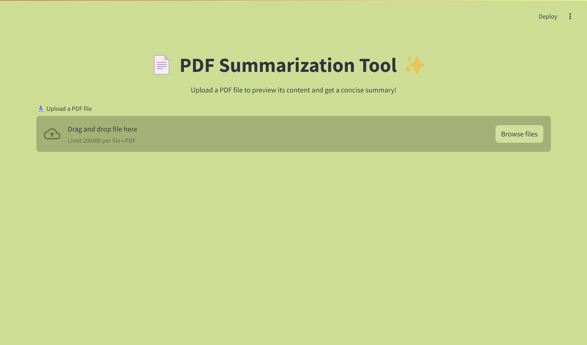
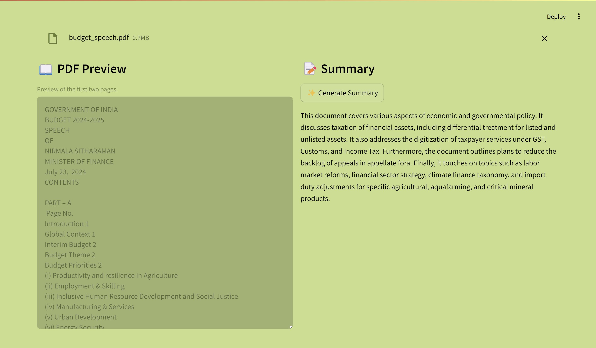

# 📄 PDF Summarizer Tool ✨

A powerful and efficient **PDF Summarization Tool** that utilizes cutting-edge technologies to provide concise and meaningful summaries of PDF documents. This application leverages the **FAISS (Facebook AI Similarity Search)** database for efficient text chunking and vector storage, paired with **Google Gemini API** for generating high-quality summaries.

---

## 🌟 Features
- **PDF Upload**: Upload your PDF documents with ease.
- **Preview PDF Content**: View the first two pages of the uploaded PDF for quick reference.
- **Advanced Summarization**: Get concise, meaningful summaries using state-of-the-art AI technology.
- **FAISS Storage**: Efficiently process and store document text chunks for rapid similarity searches.
- **Interactive Interface**: A clean, user-friendly design with side-by-side PDF preview and summary sections.

---

## 🛠️ Tech Stack
- **Streamlit**: For building the interactive web interface.
- **LangChain**: For managing text splitting, vector storage, and chain operations.
- **FAISS**: High-performance vector storage and similarity search.
- **Google Gemini API**: For generating accurate and high-quality summaries.
- **PyPDF**: For extracting text from PDF documents.

---

## 🚀 Getting Started

### Prerequisites
- Python 3.8 or higher
- Required libraries:
  - `streamlit`
  - `langchain`
  - `langchain-google-genai`
  - `pypdf`
  - `python-dotenv`

### Installation
1. Clone the repository:
   ```bash
   git clone https://github.com/meghanshgarjala/PDF_SUMMARIZER.git
   cd PDF_SUMMARIZER

2. Install dependencies:
    ```bash
    pip install -r requirements.txt

3. Add your Google Gemini API credentials to a .env file:
    ```bash
    GOOGLE_API_KEY=your_api_key_here

4. Run the Application

    Start the Streamlit app:
    ```bash
    streamlit run app.py

### 🖼️ Application Screenshots





### 🤝 Contributing

Contributions are welcome! Please fork the repository and create a pull request with your changes. Ensure all contributions align with the project's goals and maintain a professional standard.

### 🛡️ License

This project is licensed under the MIT License. See the LICENSE file for details.

### 📧 Contact

For any queries or support, feel free to reach out:


